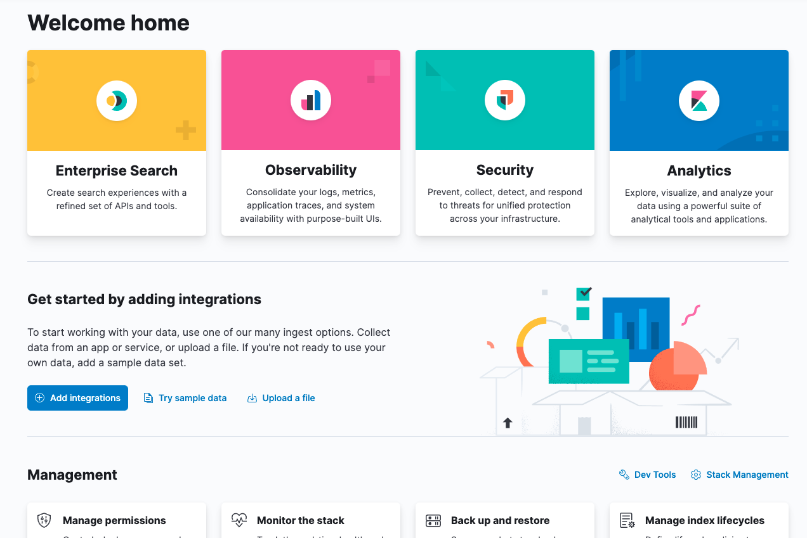
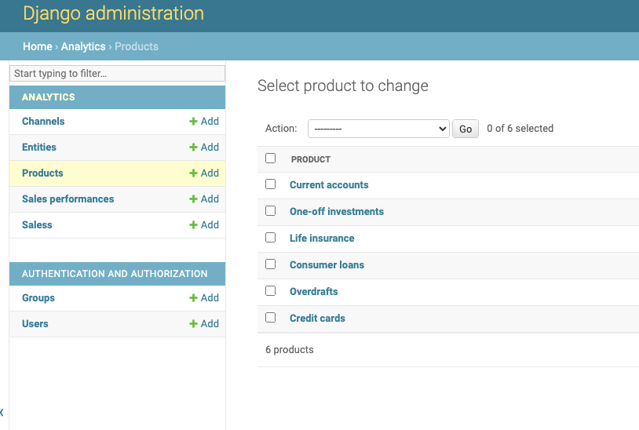
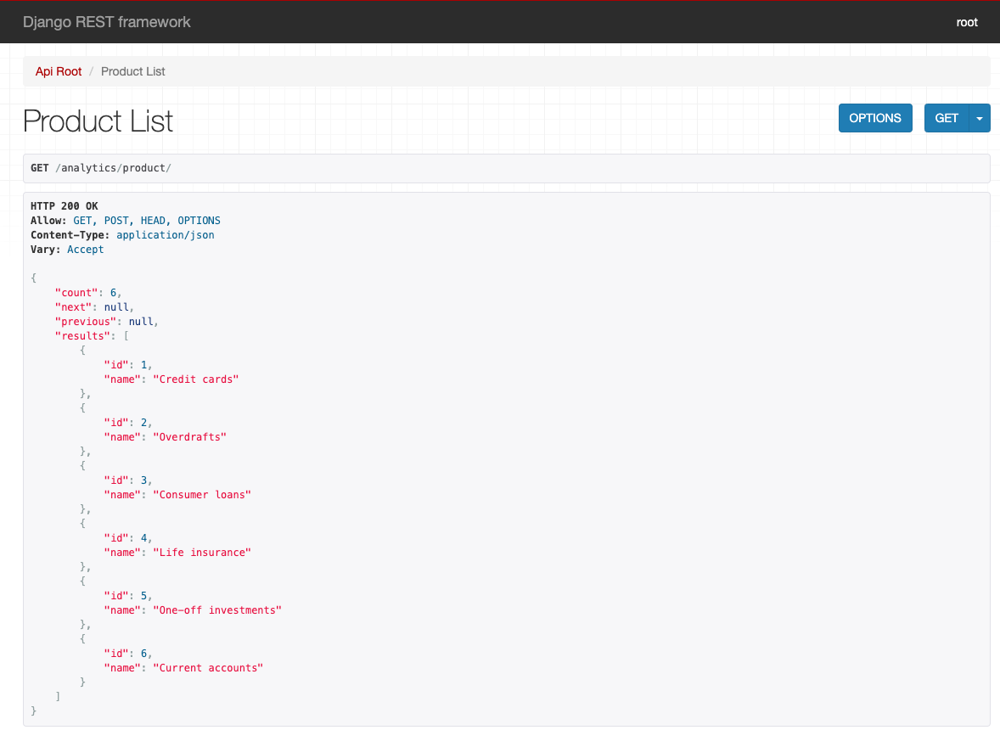
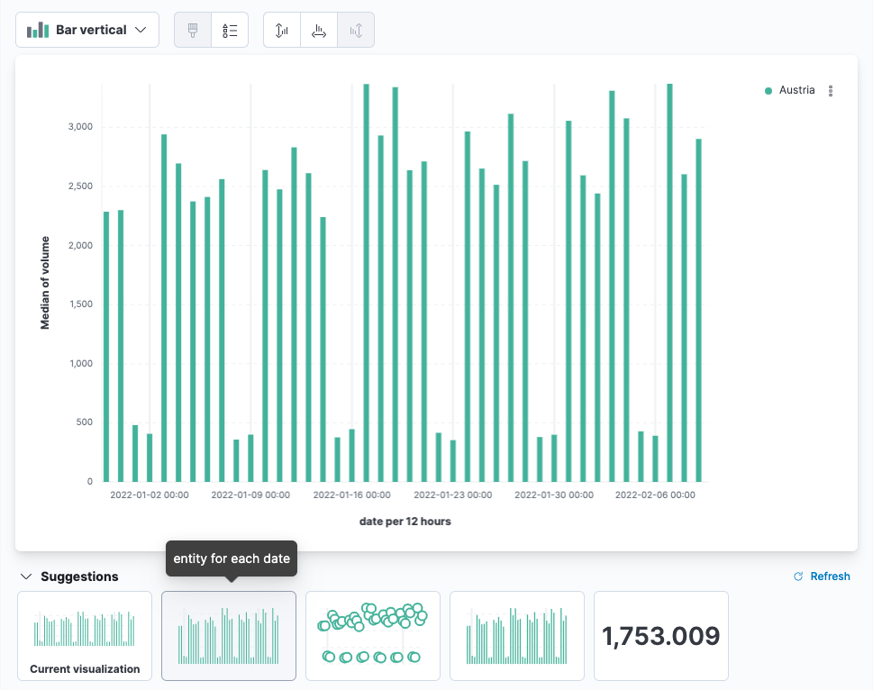
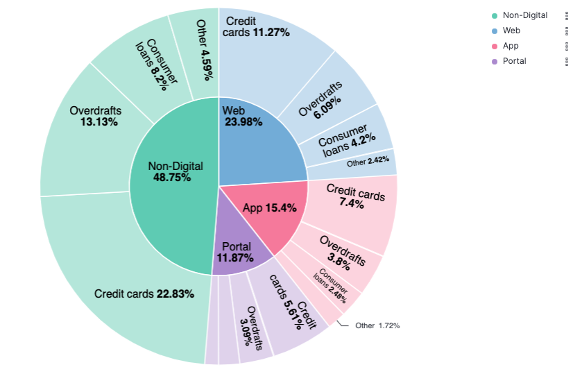
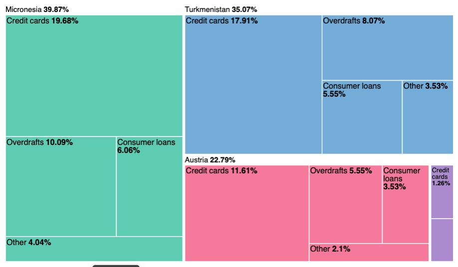

# python-elastic-ingest

My attempt to collect and analyze arbitrary business performance data.

The Django app framework provides plenty of capabilities to grow business logic around data entry (user management, API keys, etc.). Depending on our user's
maturity any of these methods of entering data is possible:

- web interface
- API calls
- csv upload

Whereas the data is safely stored (and later on editable) in a conventional
RDBMS, the analytical part is served with the ELK stack. Django's 
`django-elasticsearch-dsl` takes care to push data in real-time. 

## Setup

### ELK

Both **elasticsearch** and **Kibana** are shiped as Docker containers. Simply
run them with:

```
docker-compose up
```

Once this command yields any result elasticsearch is up and running:

```
curl -X GET "localhost:9200/_cat/nodes?v&pretty"
```



You can now visit your local installation of Kibana: http://localhost:5601


### Django

Django is installed in a virtual environment. Simply follow these steps:

```
virtualenv --python=python3 venv
source venv/bin/activate
pip install -r requirements.txt
```

This creates a simple `sqlite3` database file which is sufficient for this
PoC. Subsequently some sample data is loaded into the database:

```
cd core
./manage.py migrate
./manage.py loaddata fixtures/user.json
./manage.py loaddata fixtures/sales.json
./manage.py loaddata fixtures/channels.json
./manage.py loaddata fixtures/products.json
./manage.py loaddata fixtures/entities.json
```

Start Django:

```
python manage.py runserver
```

And visit the two interesting pages:



Admin: http://127.0.0.1:8000/admin/ (Superuser `root` with password `root`)
 


REST: http://127.0.0.1:8000/analytics/


To have some real fun, let's create fake sales data via REST:

```
cd # to base directory
python make-salesperformance.py
```

# Creating dashboards with Lens

I'm not an expert in Kibana. But after a few clicks I had created a so-called
`Index pattern` for my `salesperformance` data. Once done, you can easily
create visualizations using Lens.





# Dev hints
```
python manage.py search_index --rebuild
```

# References

A lot of good ideas stolen from Nik Tomazic' amazing tutorial https://testdriven.io/blog/django-drf-elasticsearch/

Elasticsearch setup taken from https://www.elastic.co/guide/en/elastic-stack-get-started/current/get-started-docker.html